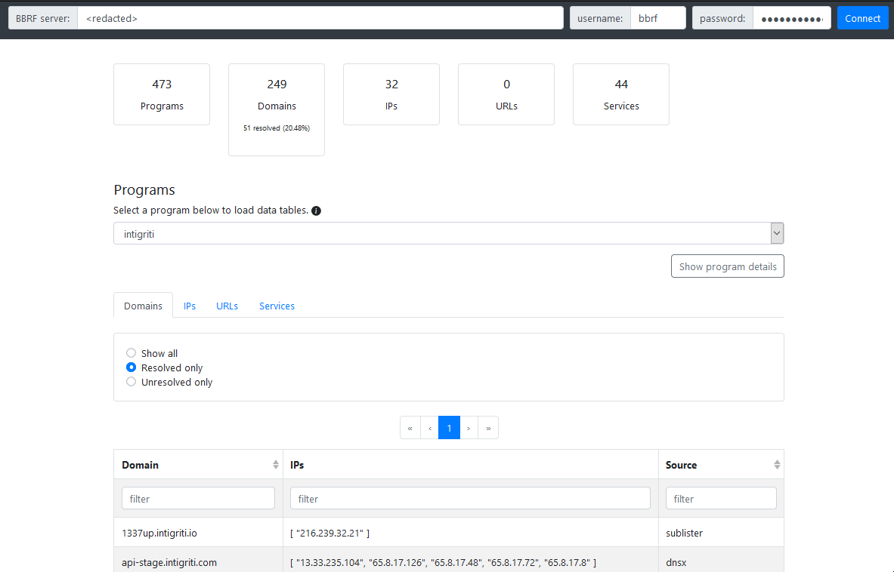

## Introduction

This was forked from Honoki so it can be ran locally and not require the BBRF server to be open to the internet. This can be run using 'npm run serve' on the local machine.

The Bug Bounty Reconnaissance Framework (BBRF) can be used to coordinate your reconnaissance workflows across multiple devices. For more background, read [the original blog post](https://honoki.net/2020/10/08/introducing-bbrf-yet-another-bug-bounty-reconnaissance-framework/).

If you are new to BBRF, you will need to deploy a [BBRF server](https://github.com/honoki/bbrf-server) and start using the [BBRF client](https://github.com/honoki/bbrf-client) before you can enjoy this dashboard.

## Dashboard

Just plug in your server URL, username and password, and the dashboard will pull your data and make it searchable. Note that all communication to the server happens via your browser, so your data remains safe!

### Features

* Select a program and view the program details;
* View your domains, IPs, URLs and services in a clear overview;
* Switch between unresolved and resolved domains;
* Filter your data with the search boxes on the data tables;
* Copy all identifiers from the first column with the "Copy to clipboard" button below the data tables;
* Data tables are automatically limited to show the first 2000 records of every view, click "load more" to continue loading more records; (Note that this will impact the memory use of your browser);
* Communication with the BBRF server happens via API calls from the client-side application directly to your server to avoid credentials and/or recon data passing through any additional servers;
* View your BBRF alerts right from the dashboard;

### Troubleshooting

The dashboard requires your server to be available via HTTPS, and that `https://bbrf.me` is allowed as a CORS origin on your BBRF server.

### See also

* [BBRF Client](https://github.com/honoki/bbrf-client)
* [BBRF Server](https://github.com/honoki/bbrf-server)
* [BBRF Agents](https://github.com/honoki/bbrf-agents)
* [BBRF Burp Plugin](https://github.com/honoki/bbrf-burp-plugin)
